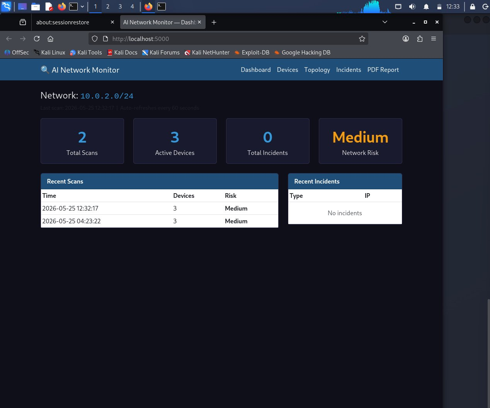
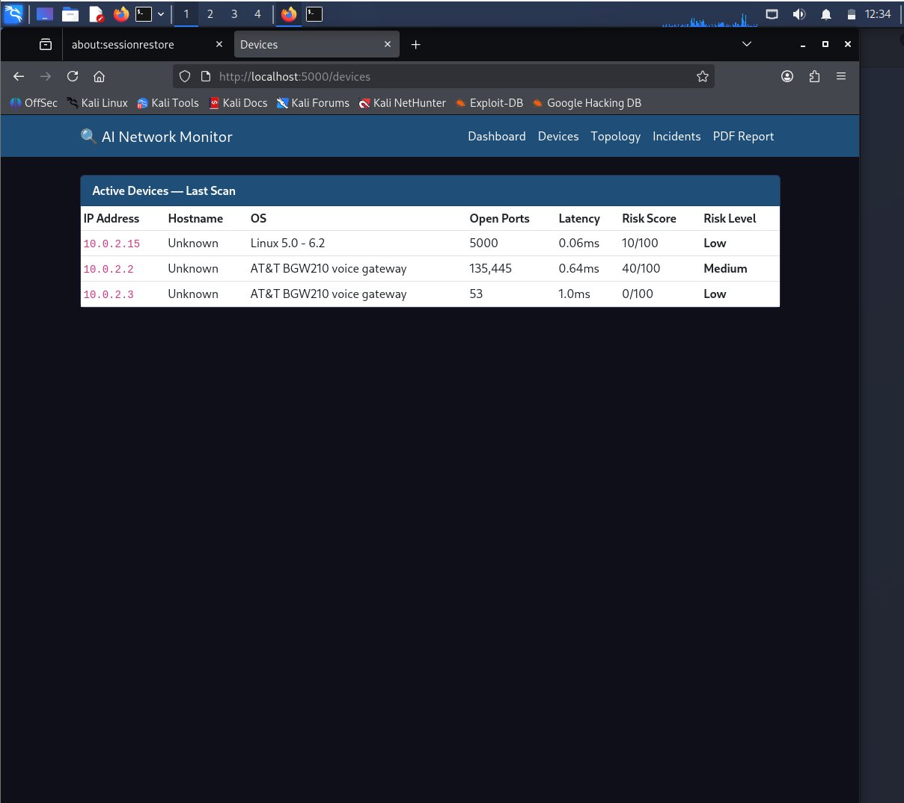
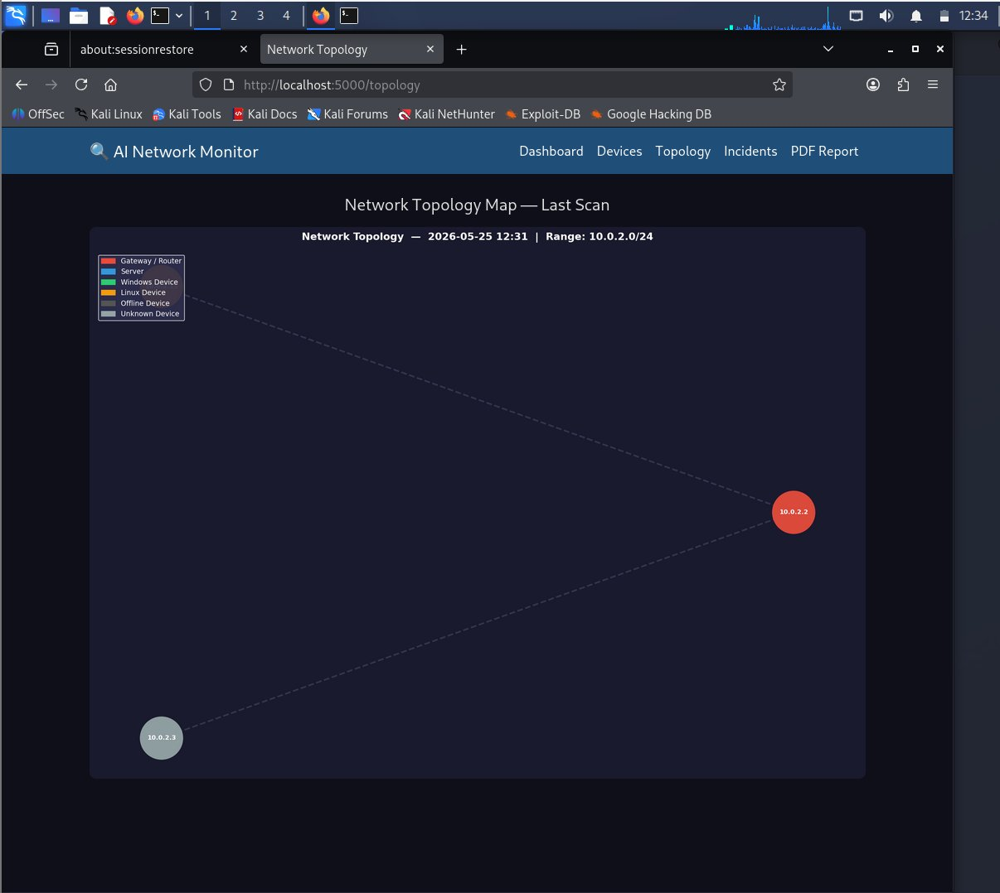
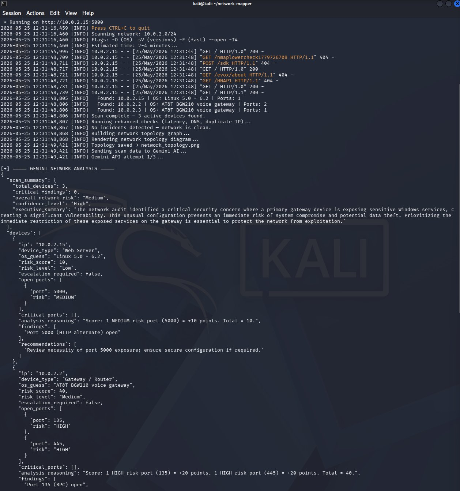
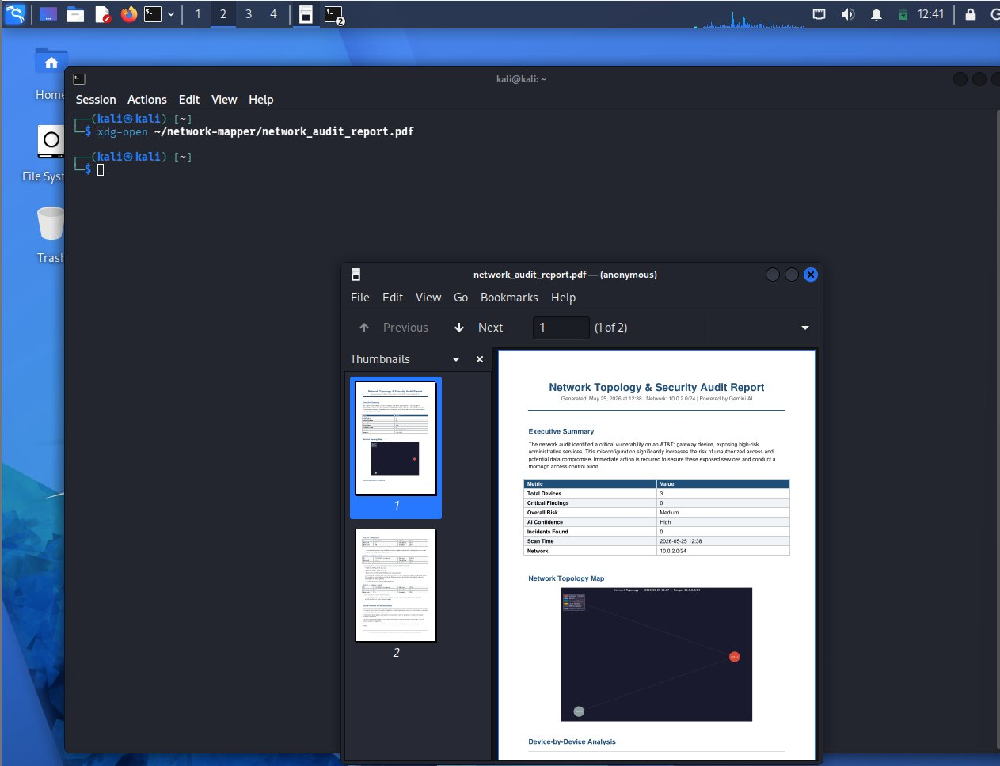
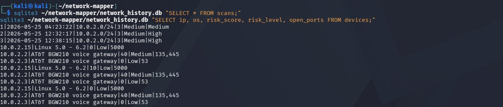

# AI-Powered Network Security Monitoring & Topology Audit System

Automated network security monitoring platform — continuous Nmap scanning, local Python risk engine, CVE correlation via NVD API, ARP-verified topology mapping, incident detection, SQLite history, Flask dashboard with authentication, and Gemini AI audit reports.

## What It Does

* Scans the network every 5 minutes using Nmap to discover devices, open ports, operating systems, and service versions.
* Uses a local Python risk engine to score every device (0–100) before AI analysis.
* Performs CVE lookups through the NVD API for detected services and versions.
* Builds an ARP-verified network topology using MAC vendor identification.
* Detects new devices, offline devices, newly opened ports, and topology changes.
* Checks latency, DNS issues, duplicate IP addresses, and configuration anomalies.
* Generates professional security audit reports using Gemini AI with MITRE ATT&CK T1046 mapping.
* Provides a Flask-based dashboard for device inventory, topology visualization, and incident history.
* Exports PDF audit reports using ReportLab.
* Sends Discord webhook alerts after every scan cycle.

## Tech Stack

| Tool                    | Purpose                                     |
| ----------------------- | ------------------------------------------- |
| Python 3                | Core automation                             |
| Nmap + python-nmap      | Network discovery and port scanning         |
| NetworkX + Matplotlib   | Topology graph generation and visualization |
| NVD API                 | Vulnerability intelligence and CVE lookup   |
| Google Gemini 2.5 Flash | AI-powered audit analysis                   |
| SQLite                  | Historical scan storage                     |
| Flask                   | Web dashboard and authentication            |
| ReportLab               | PDF report generation                       |
| Discord Webhooks        | Real-time alert notifications               |

## Screenshots

### Dashboard Home



### Device Inventory



### Network Topology Map



### Gemini AI Analysis



### PDF Audit Report



### SQLite Scan History



## Sample Output Files

* network_audit_report.pdf
* network_topology.png

## Installation

```bash
git clone https://github.com/Praneeth-oss/network-security-monitor.git
cd network-security-monitor
pip install -r requirements.txt
```

## Configuration

Edit the configuration section inside `network_mapper.py`:

* `NETWORK_RANGE`
* `GEMINI_API_KEY`
* `DISCORD_WEBHOOK`
* `SCAN_INTERVAL`
* `LATENCY_THRESHOLD`

## Run

```bash
sudo python3 network_mapper.py
```

Dashboard:

```text
http://localhost:5000
```

## Disclaimer

This project is intended for educational and defensive cybersecurity purposes only. Run it only on networks you own or have explicit authorization to assess.

## Author

**Praneeth Pentakota**

GitHub: https://github.com/Praneeth-oss

LinkedIn: https://linkedin.com/in/praneethpentakota
